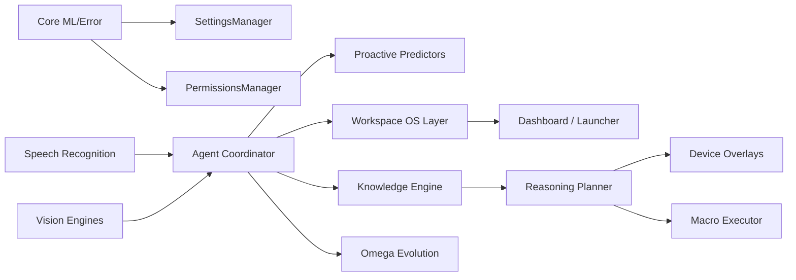

# Project Connection Graph

```mermaid
graph LR
    Core[Core ML/Error] --> Settings[SettingsManager]
    Core --> Permissions[PermissionsManager]
    
    Speech[Speech Recognition] --> Coordination[Agent Coordinator]
    Vision[Vision Engines] --> Coordination
    
    Coordination --> Proactive[Proactive Predictors]
    Coordination --> Knowledge[Knowledge Engine]
    Coordination --> Workspace[Workspace OS Layer]
    Coordination --> Evolution[Omega Evolution]
    
    Workspace --> UI[Dashboard / Launcher]
    Knowledge --> Reasoning[Reasoning Planner]
    
    Reasoning --> Device[Device Overlays]
    Reasoning --> Automation[Macro Executor]
```
