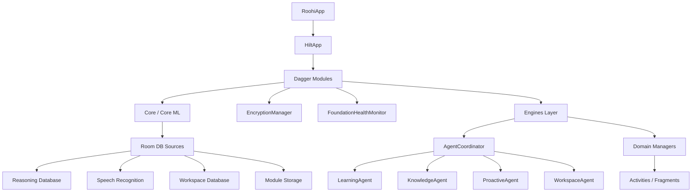

# Project Dependency Graph

```mermaid
graph TD
    App[RoohiApp] --> HiltApp
    HiltApp --> DiComponents[Dagger Modules]
    
    DiComponents --> Foundation[Core / Core ML]
    DiComponents --> Security[EncryptionManager]
    DiComponents --> Background[FoundationHealthMonitor]
    
    Foundation --> Database[Room DB Sources]
    Database --> ReasoningDB[Reasoning Database]
    Database --> SpeechDB[Speech Recognition]
    Database --> WorkspaceDB[Workspace Database]
    Database --> ModuleDBs[Module Storage]
    
    DiComponents --> Engines[Engines Layer]
    Engines --> Coordination[AgentCoordinator]
    
    Coordination --> LearningAgent
    Coordination --> KnowledgeAgent
    Coordination --> ProactiveAgent
    Coordination --> WorkspaceAgent
    
    Engines --> Domain[Domain Managers]
    Domain --> Presenter[Activities / Fragments]
```
