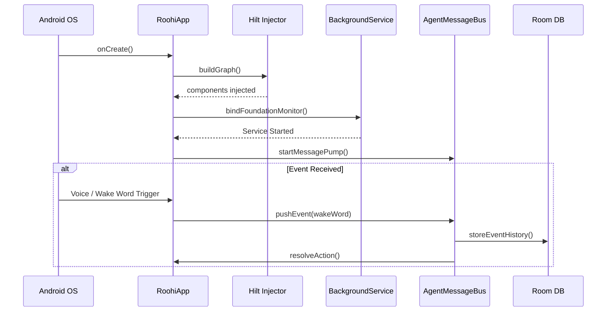

# Project Runtime Execution Graph

```mermaid
sequenceDiagram
    participant OS as Android OS
    participant App as RoohiApp
    participant Hilt as Hilt Injector
    participant BG as BackgroundService
    participant AM as AgentMessageBus
    participant DB as Room DB

    OS->>App: onCreate()
    App->>Hilt: buildGraph()
    Hilt-->>App: components injected
    
    App->>BG: bindFoundationMonitor()
    BG-->>App: Service Started
    
    App->>AM: startMessagePump()
    
    alt Event Received
        OS->>App: Voice / Wake Word Trigger
        App->>AM: pushEvent(wakeWord)
        AM->>DB: storeEventHistory()
        AM->>App: resolveAction()
    end
```
